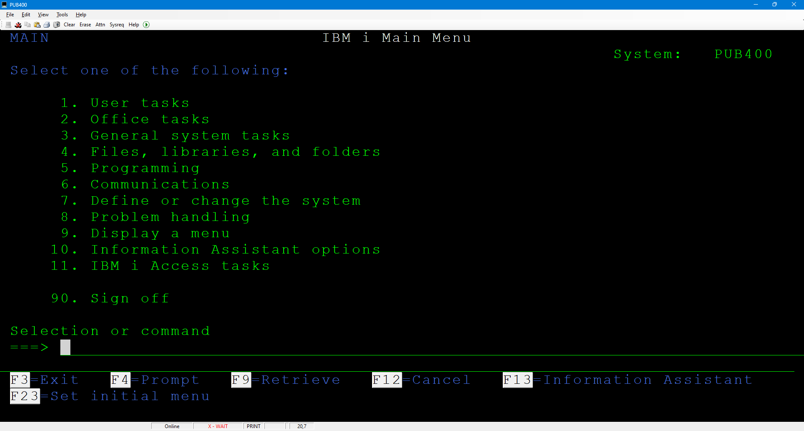
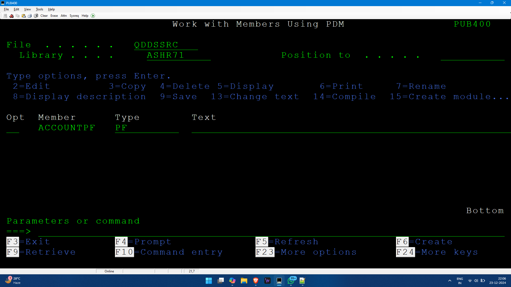
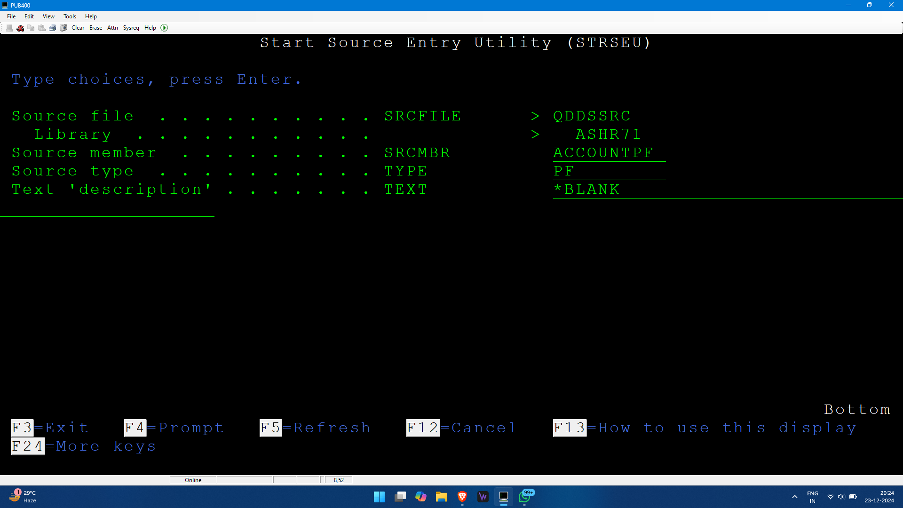
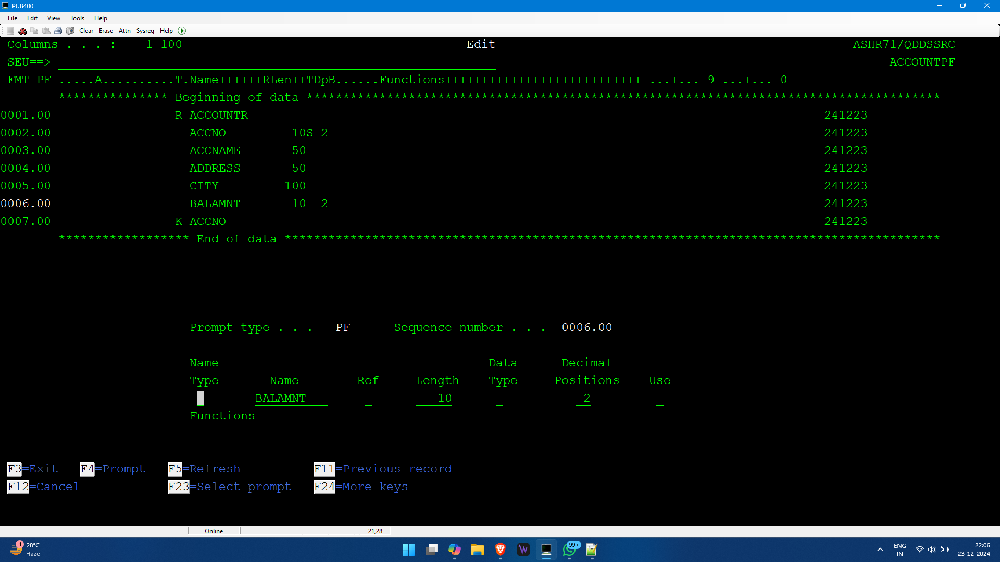

# Day 1 - 23 Dec 2024

- **IBM i**: A machine designed to replace mainframes at a lower cost.
- **OS**: OS400
- **Database**: DB2
- **Software used ot access OS400**: Mochasoft

- **References**:
  - [Go4AS400](https://www.go4as400.com/)
  - [AS-400 Training GitHub Wiki](https://github.com/skill-at/AS-400-Training/wiki)

- **IBM® Rational® Developer for i (RDi)**: Provides an integrated development environment (IDE) to create, maintain, and modernize applications on the IBM i platform.

## Source Physical File
1. Create a source member.
2. Compile that member to create an AS400 object.

If there is a file of RPGLE, it will be kept in `qrpgsrc` or `qrpglsrc`, like that CLP in `qclsrc`, SQL in `qsqlsrc`, DDS in `qddssrc`.

### Common Commands
- **CREATE**: Starts with `CRT`
- **DELETE**: Starts with `DLT`
- **WORK**: Starts with `WRK`
- **DISPLAY**: Starts with `DSP`
- **COPY**: Starts with `CPY`
- **Library**: `LIB`
- **Source**: `SRC`

- **To create a library**: `CRTLIB`
- **To create a source physical file**: `CRTSRCPF`

### Naming Standards for Source Files
- `QDDSSRC` for DDS file
- `QRPGLSRC`
- `QCLSRC` for CL Source

**`QTEMP`**: Temporary buffer library

---

## Creating Database Files

### Two Ways:
1. **DDS Way**:
   - Two types of files:
     - **Physical Files**: Contains actual data.
     - **Logical Files**: Views on physical file data (like views/indexes in SQL), can be built on one or multiple physical files.
   - **Commands**:
     1. Prompt: `WRKMBRPDM`
     2. File: `QDDSSRC`
        - Clicking F6 will go to SEU.
        - Member: `ACCOUNTPF`

		

		

   #### Requirement for Physical File:
   - **(Key) ACCOUNTNO**: Numeric, Max Length: 10
   - **ACCOUNTNAME**: Char, Length: 50
   - **ADDRESS**: Char, Length: 100
   - **ACNTBAL**: Numeric, Length: 10, Decimal Positions: 2

   #### Syntax:
   1. **File Level Entries**:
      - Not mandatory; contains only functions/keywords.
   2. **Record Level Entries**:
      - Contains type, name, and functions.
      - Type `R` for record level entry.
      - Click F4, Type: `R`, Name: `ACCOUNTR`
   3. **Field Level Entries**:
      - Contains field names, data types, keywords.
      - Click F4, Name: `ACCNTNO`, Length: 10, Position: 0
      - Click F4, Name: `ACNTNAME`, Length: 50
      - Repeat for `ADDRESS` and `CITY`
      - Click F4, Name: `BALAMNT`, Length: 10, Decimal Positions: 2 (ensure no blank space in length)
   4. **Key Level**:
      - To add the key.
      - Click F4, Type: `K`, Name: `ACCNTNO`
      - Save and continue by typing `SAVE` in SEU line.

	  
	  This contains the physical file entry data. Beware of spaces.
   
   #### Create an Object by Compiling the Source Member:
   - Go back to PDM, add Option 14 to compile.
   - Check `WRKOBJ` to see the object files.
   
   #### Enter Data (Row):
   - Command: `UPDDTA ACCOUNTPF`
     - To change according to some account number, enter the number in the account number field and click F5 in format.
     - New Entry: F10
   
   #### View the Entered Data:
   - Command: `RUNQRY *N ACCOUNTPF`

2. **SQL/DDL**:
   - To start SQL, use `STRSQL` and press ENTER; SQL SESSION will appear, and add your SQL queries. If you don't know the syntax, use F4 to prompt and make the query.
   - **Retrieve (F9)**: Can be used to get the used line again. Keep the cursor on the query to be repeated and click F9; that query will appear.

### Important Notes:
- For the primary key in DDS, it should be explicitly mentioned to make it unique; otherwise, it won't be unique just by being the key.
  - Go to PDM, use EDIT (Option 2), before the file level, make a line, and in functions add `UNIQUE`. Then Compile.
- After compiling, a new object is created, and the data will be erased. To avoid this, back up the data.

### Sample Logical File:
- **Need for Logical File**:
  - Example: If there is a table with `EMPNO` and `EMPCITY`, where `EMPNO` is the key. If you want to get employee data according to the city and make `EMPCITY` the key, it will affect other programs if you just change the key. Instead, create a logical view and make `EMPCITY` the key and work on it.

  - **Commands**:
    - Go to PDM, click F6, Create a source adding LF type and all (name: `ACCOUNTLF`), Get into Edit => Prompt type = R, Record Name = `ACCOUNTR` (exactly the same as the physical filename), in functions add "PFILE(ACCOUNTPF)" (to know which is the physical file).
    - Next line: add Type K, Name: `CITY` (no need for file level entry since we need all fields).
    - Compile it, then run: `RUNQRY *N ACCOUNTLF`
    - If you update the logical file, it will update the physical file too. i.e., Logical file creates an access path to the physical file.

