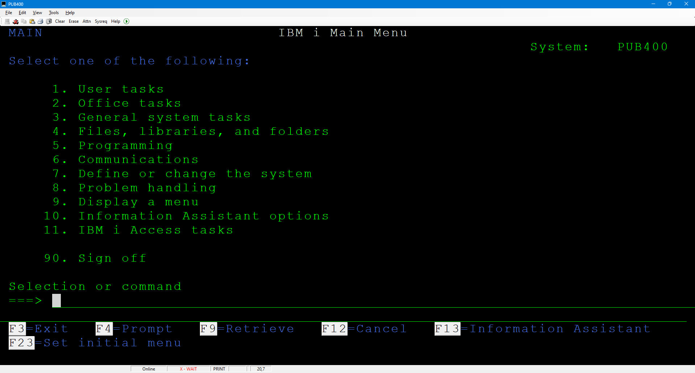
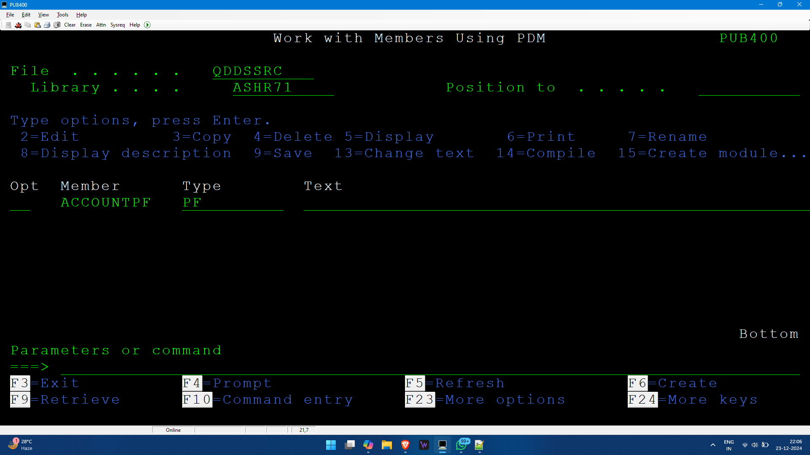
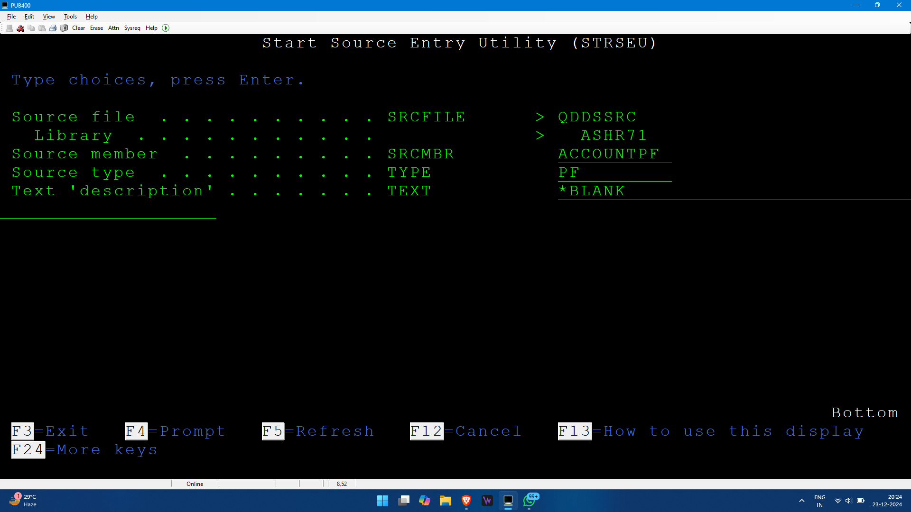
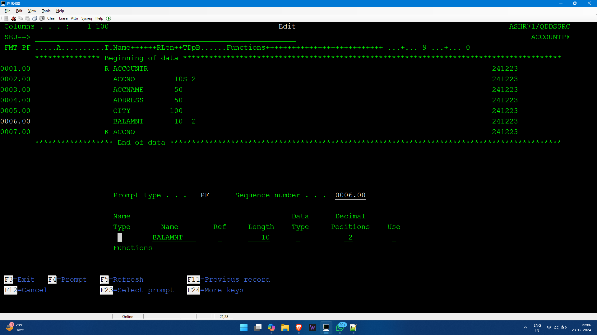

# as400_myNotes

Welcome to my notes for AS400. I am making these notes based on the lecture I am attending, from my research, and my own knowledge.

There could be mistakes; you are free to correct me. Thank you!

Have a look below for better understanding and view.

## Table of Contents
* [Introduction](##Introduction)
* [Creating Database Files](##Creating Database Files)
* [Control Language](#CL)
- [Cheatsheet for Commands](Cheatsheet.md)


## Introduction
- **IBM i**: A machine designed to replace mainframes at a lower cost.
- **OS**: OS400
- **Database**: DB2
- **Software used ot access OS400**: Mochasoft

- **References**:
  - [Go4AS400](https://www.go4as400.com/)
  - [AS-400 Training GitHub Wiki](https://github.com/skill-at/AS-400-Training/wiki)

- **IBM® Rational® Developer for i (RDi)**: Provides an integrated development environment (IDE) to create, maintain, and modernize applications on the IBM i platform.



## Source Physical File
1. Create a source member.
2. Compile that member to create an AS400 object.

If there is a file of RPGLE, it will be kept in `qrpgsrc` or `qrpglsrc`, like that CLP in `qclsrc`, SQL in `qsqlsrc`, DDS in `qddssrc`.

### Common Commands
- **CREATE**: Starts with `CRT`
- **DELETE**: Starts with `DLT`
- **WORK**: Starts with `WRK`
- **DISPLAY**: Starts with `DSP`
- **COPY**: Starts with `CPY`
- **Library**: `LIB`
- **Source**: `SRC`

- **To create a library**: `CRTLIB`
- **To create a source physical file**: `CRTSRCPF`


### Naming Standards for Source Files
- `QDDSSRC` for DDS file
- `QRPGLSRC`
- `QCLSRC` for CL Source

**`QTEMP`**: Temporary buffer library

---

## Creating Database Files

### Two Ways:
1. **DDS Way**:
   - Two types of files:
     - **Physical Files**: Contains actual data.
     - **Logical Files**: Views on physical file data (like views/indexes in SQL), can be built on one or multiple physical files.
   - **Commands**:
     1. Prompt: `WRKMBRPDM`
     2. File: `QDDSSRC`
        - Clicking F6 will go to SEU.
        - Member: `ACCOUNTPF`

		

		


   #### Requirement for Physical File:
   - **(Key) ACCOUNTNO**: Numeric, Max Length: 10
   - **ACCOUNTNAME**: Char, Length: 50
   - **ADDRESS**: Char, Length: 100
   - **ACNTBAL**: Numeric, Length: 10, Decimal Positions: 2

   #### Syntax:
   1. **File Level Entries**:
      - Not mandatory; contains only functions/keywords.
   2. **Record Level Entries**:
      - Contains type, name, and functions.
      - Type `R` for record level entry.
      - Click F4, Type: `R`, Name: `ACCOUNTR`

      
      To add a new line, use `I` in the left part as shown above. To add multiple lines, add the number of lines along with `I` like `I2` for add 2 lines. If you want to add the lines in between any field or record, keep the pointer above on left where you want to add and type `I` and enter.
   3. **Field Level Entries**:
      - Contains field names, data types, keywords.
      - Click F4, Name: `ACCNTNO`, Length: 10, Position: 0
      - Click F4, Name: `ACNTNAME`, Length: 50
      - Repeat for `ADDRESS` and `CITY`
      - Click F4, Name: `BALAMNT`, Length: 10, Decimal Positions: 2 (ensure no blank space in length)
   4. **Key Level**:
      - To add the key.
      - Click F4, Type: `K`, Name: `ACCNTNO`
      - Save and continue by typing `SAVE` in SEU line.

	  
	  This contains the physical file entry data. Beware of spaces.
   
   #### Create an Object by Compiling the Source Member:
   - Go back to PDM, add Option 14 to compile.
   - Check `WRKOBJ` to see the object files.
   
   #### Enter Data (Row):
   - Command: `UPDDTA ACCOUNTPF`
     - To change according to some account number, enter the number in the account number field and click F5 in format.
     - New Entry: F10
   
   #### View the Entered Data:
   - Command: `RUNQRY *N ACCOUNTPF`

2. **SQL/DDL**:
   - To start SQL, use `STRSQL` and press ENTER; SQL SESSION will appear, and add your SQL queries. If you don't know the syntax, use F4 to prompt and make the query.
   - **Retrieve (F9)**: Can be used to get the used line again. Keep the cursor on the query to be repeated and click F9; that query will appear.

### Important Notes:
- For the primary key in DDS, it should be explicitly mentioned to make it unique; otherwise, it won't be unique just by being the key.
  - Go to PDM, use EDIT (Option 2), before the file level, make a line, and in functions add `UNIQUE`. Then Compile.
- After compiling, a new object is created, and the data will be erased. To avoid this, back up the data.

### Sample Logical File:
- **Need for Logical File**:
  - Example: If there is a table with `EMPNO` and `EMPCITY`, where `EMPNO` is the key. If you want to get employee data according to the city and make `EMPCITY` the key, it will affect other programs if you just change the key. Instead, create a logical view and make `EMPCITY` the key and work on it.

  - **Commands**:
    - Go to PDM, click F6, Create a source adding LF type and all (name: `ACCOUNTLF`), Get into Edit => Prompt type = R, Record Name = `ACCOUNTR` (exactly the same as the physical filename), in functions add "PFILE(ACCOUNTPF)" (to know which is the physical file).
    - Next line: add Type K, Name: `CITY` (no need for file level entry since we need all fields).
    - Compile it, then run: `RUNQRY *N ACCOUNTLF`
    - If you update the logical file, it will update the physical file too. i.e., Logical file creates an access path to the physical file.

----------------------------------------------------------------

# Commands Learnt

- `CRTLIB`
- `WRKMBRPDM`
- `UPDDTA`
- `WRKOBJ`
- `RUNQRY *N`
- `STRSQL`
- `CRTSRCPF `


### Creating a Library and Source Physical File

- Create a library:
  ```plaintext
  CRTLIB ashlib
  ```
  - To check if the library exists:
  ```plaintext
  WRKOBJ ashlib
  ```

- Create a source physical file:
  ```plaintext
  CRTSRCPF FILE(ashlib/qddssrc)
  ```

- Work with members in the source physical file:
  ```plaintext
  WRKMBRPDM FILE(ashlib/qddssrc)
  ```

- Create a member.

**Note**: Numbers need to be left-justified. To do this, click insert and then space. To use F keys higher than 12, use shift + the incremented value (e.g., for F14, click shift + 2; for F20, click shift + 8).

### Levels in Logical File

- File level
- Record level - `R`
- Field level - needs `PFILE()`
- Key level - `K`
- Select/Omit level - `S` or `O`

### Handling Errors

- **Logical file error due to library default**: Use the `CHGCURLIB` command to set your library as the current library, then compile.
  ```plaintext
  CHGCURLIB LIB(ashlib)
  ```

- **Debugging Errors**:
  - Check all spool files created by an interactive job:
  ```plaintext
  WRKSPLF
  ```
  - Select assistance level or F21, and change it to 2 intermediate.
  - Give 5 in opt to display and then give B in control to get to the bottom of the file as the error will be present at the end of the file.
  
- **Delete spool file**:
  ```plaintext
  DLTSPLF *SELECT
  ```

### File and Object Commands

- Display file field description:
  ```plaintext
  DSPFFD
  ```

- Display file description:
  ```plaintext
  DSPFD
  ```

- Display all files starting with `emplf` objects:
  ```plaintext
  WRKOBJ emplf*
  ```

- Display all dependent files (especially logical file objects):
  ```plaintext
  DSPDBR FILE(ashlib/<FILE>)
  ```

- Delete objects (object type will be *FILE):
  ```plaintext
  DLTOBJ OBJ(ashlib/<FILE>) OBJTYPE(*FILE)
  ```


### Operators and Keywords

- **Operators**:
  - COMP EQ/GT
  - CMP
  - VALUES
  - LIST

  Give this when using S/O type to compare and select the fields in the function field. For example:
  ```plaintext
  CMP(EQ 'HYD')
  ```

  With dynamic select, it happens at run time. It happens after the system runs and identifies all.

### Lowercase Values

- To allow lowercase values, go to edit change source settings "Change session defaults" or F13. Then change uppercase input only to `N`.

### Joining Fields

- For joins, if you need to take a common field into the output, use `JREF()` and mention from which file to show. For example, `JREF(1)` if you need to refer to the first file.

### Data Types in DDS

- **A**: Character
- **P**: Packed Decimal (default: 2 digits occupy 1 byte) 5 or 6 bytes
- **S**: Zoned Decimal (1 digit occupies 1 byte) 10 bytes
- **L**: Date
- **T**: Time
- **Z**: Timestamp

### Keywords / Functions

- **File Level**: `UNIQUE`, `FIFO`, `LIFO`, `FCFO`, `DYNSLT`, `JDFVAL`
- **Record Level**: `PFILE`, `JFILE`, `TEXT`
- **Field Level**: `JREF` (Join if), `COLHDG` (Column heading), `VALUES`/`CMP`
- **Key Level**: `ABSVAL` (Absolute value), `ALIAS`, `DESCEND`

### SQL

- Can be done using `STRSQL`, but it's preferable to create files in `QSQLSRC` for future alterations.
  - Create source file `QSQLSRC`.
  - Create a source member for SQL type.

**Note**: SQL cannot be compiled using option 14 here. To execute SQL, use the command `RUNSQLSTM`, go for prompt `F4` give commitment control as none.


- **NOT NULL WITH DEFAULT** is added because when inserting data only to specific columns and others are left empty, SQL will assign default values like 0 for int, space for text instead of NULL, which causes problems with RPG programming.

- **Updating the Table**: You have to delete the table if you want to update the table structure. Create table can only be done once.
```plaintext
DROP TABLE <TABLE>
```

### ASSIGNMENT -  CREATE STUDENT TABLE AND MARKS TABLE, ENTER DATA.... ROLLNO, TOTAL MARKS, MARKS OBTAINED, PERCENTAGE... CREATE A VIEW.

Student table:

 Columns . . . :    1  80                                      Browse                                                ASHLIB/QSQLSRC 
 SEU==>                                                                                                                  STDNTTABLE 
 FMT **  ...+... 1 ...+... 2 ...+... 3 ...+... 4 ...+... 5 ...+... 6 ...+... 7 ...+... 8                                            
        *************** Beginning of data ***************************************************************************************   
0001.00 CREATE OR REPLACE TABLE STDNTTABLE (                                                 241226                                 
0002.00 ROLLNO INTEGER NOT NULL WITH DEFAULT,                                                241226                                 
0003.00 NAME VARCHAR(20) NOT NULL WITH DEFAULT,                                              241226                                 
0004.00 ADDRESS VARCHAR(20) NOT NULL WITH DEFAULT,                                           241226                                 
0005.00 PRIMARY KEY (ROLLNO)                                                                 241226                                 
0006.00 );                                                                                   241226                                 
        ****************** End of data ******************************************************************************************   
                                                                                                                                    
                                                                                                                                   
                                                                                                                                   
MARKS TABL:
 Columns . . . :    1  80                                      Browse                                                ASHLIB/QSQLSRC 
 SEU==>                                                                                                                  MARKSTABLE 
 FMT **  ...+... 1 ...+... 2 ...+... 3 ...+... 4 ...+... 5 ...+... 6 ...+... 7 ...+... 8                                            
        *************** Beginning of data ***************************************************************************************   
0001.00 CREATE OR REPLACE TABLE MARKSTABLE (                                                 241226                                 
0002.00 ROLLNO INTEGER NOT NULL WITH DEFAULT,                                                241226                                 
0003.00 MARKS_OBTAINED NUMERIC NOT NULL WITH DEFAULT,                                        241226                                 
0004.00 TOTAL_MARKS NUMERIC NOT NULL WITH DEFAULT,                                           241226                                 
0005.00 PRIMARY KEY (ROLLNO));                                                               241226                                 
        ****************** End of data ******************************************************************************************   
                                                                                                                                    
VIEW WITH JOIN:
 Columns . . . :    1  80                                      Browse                                                ASHLIB/QSQLSRC 
 SEU==>                                                                                                                  JV_SDTMRKS 
 FMT **  ...+... 1 ...+... 2 ...+... 3 ...+... 4 ...+... 5 ...+... 6 ...+... 7 ...+... 8                                            
        *************** Beginning of data ***************************************************************************************   
0001.00 CREATE VIEW JV_SDTMRKS AS                                                            241226                                 
0002.00 SELECT A.ROLLNO, A.NAME,                                                             241226                                 
0003.00     SUM(B.MARKS_OBTAINED) AS TOTAL_MARKS_OBTAINED,                                   241226                                 
0004.00     SUM(B.TOTAL_MARKS) AS TOTAL_MAX_MARKS,                                           241226                                 
0005.00     CAST(ROUND((SUM(B.MARKS_OBTAINED) * 100.0 / SUM(B.TOTAL_MARKS)), 2)              241226                                 
0006.00 AS DECIMAL(5, 2)) AS PERCENTAGE                                                      241226                                 
0007.00 FROM STDNTTABLE A JOIN                                                               241226                                 
0008.00     MARKSTABLE B ON A.ROLLNO = B.ROLLNO                                              241226                                 
0009.00 GROUP BY A.ROLLNO, A.NAME;                                                           241226                                 
                          
        ****************** End of data ******************************************************************************************   

 ```markdown
# RPGLE Programming Guide

## Day 4 - 27 Dec 2024

### SQL and Record Format
- Adding record format in SQL: While creating a table, add `rcdfmt <name>` at the end.
  - It is not a technical requirement for SQL but can be used for RPG opcodes.
  - Equivalent to R type entry in DDS.
- Data Types: CLOB, GLOB, BLOB are used for larger data sizes.
- Handling NULL values: Use `ifnull(fieldname, value_in_case_of_null)` in SQL queries.

### RPG Programming
- **Report Program Generator (RPG)**
  - Present version: RPGLE (RPG IV or RPG400)
  - Source type: RPGLE
  - Source physical file: QRPGLSRC

#### RPGLE Specifications
- **H - Control Specifications**: Controls the way the program is created and behaves (e.g., `DATFMT(*MDY)`).
- **F - File Specifications**: All file declarations.
- **D - Definition Specifications**: Variable declarations, including procedures and data structures.
- **C - Calculation Specifications**: All operations such as reading and writing records.
- **P - Procedure Specifications**: Deals with procedures of different languages (RPG ILE).
- **O - Output Specifications**: Output settings.

### Comments
- Use `*` to comment in RPGLE.

### Ending the Program
- Use the `RETURN` opcode to end the program.
- Use `EVAL *INLR = '1'` to set the last record indicator. `IN` is standard for indicators.

### Compilation and Execution
- Compile using option 14 (`CRTBNDCL`).
- Execute using `CALL <filename>`.

### Data Type Conversions
- **Decimal to Char**: `%char()`
- **Char to Decimal**: `%DEC(VAR:5:2)`
- **Date**: `%DATE(VAR_NAME)`

### Operators and Functions
- **Not equal to**: `<>`
- **Trim spaces**: `%trim()`

### Alternative to IF-ELSE: `SELECT` statement
```rpg
Select
    When condt1
        execute
    When condt2
        execute
    OTHERS
        execute
Endsl
```
- Use this only when you want to satisfy only one condition.

### Input a Number through CL
```plaintext
CALL PGM(ASHLIB/CALC4) PARM(('+') (5 (*DEC 10 0)) (4 (*DEC 10 0)))
OR
CALL PGM(ASHLIB/CALC3) PARM(('-') (X'00000000005F') (X'00000000004F'))
```
- Ensure the length is 10. `F` indicates signed bits (ensure total bits are even).

### System Values
- **Date**: `DSPSYSVAL QDATE`
- **Time**: `DSPSYSVAL QTIME`

## Day 5 - 28 Dec 2024

### Working with Files
- **F Specification**: Use F and prompt F4, enter file name, and select file types.
  - **File Types**: 
    - `I` - Input
    - `O` - Output
    - `C` - Combined (screens)
    - `U` - Update

- For database operations, use `I` (Input) and `U` (Update).

### File Designation
- **Designation**: `F` - based on procedures in the program.
- **File Format**: `E` - indicates externally described.
- **Record Address Type**: `K` - sequence of Key. Blank for order of arrival.
- **Device**: 
  - Disk for database files.
  - Workstation (`WORKSTN`) for screens.
  - Printer for reports.

### Reading Records
- Use `read` operation code with the file name in factor 2.

### Loops
- **For**: Use with indexes like arrays.
- **Do While (DOW)**: Use for positive conditions in file processing.
- **Do Until (DOU)**: Use for negative conditions in file processing.

### Pointer Operations
- **SETLL**: Set lower limit (to set pointer).
  - If a match is found, it points to that match; otherwise, it moves to the next available item.
- **SETGT**: Set greater limit (always points to the next greater item).

### Reverse Reading
- Use `readp` (read previous).

### Special Values
- **Set Lower Limit**: `*loval`
- **Set Greater Limit**: `*hival`

### Reading Equals
- **READE**: Read equal, reads the next record with the same key value.


A detailed differentiation table for `READ`, `READE`, `READP`, and `READPE` operations in RPGLE:

| Operation | Description                                           | Usage Example          | Key Considerations  |
|-----------|-------------------------------------------------------|------------------------|---------------------|
| **READ**  | Reads the next record in the file sequentially        | `READ MYFILE`          | - Sequential reading - Ignores key structure |
| **READE** | Reads the next record with the same key value         | `READE key MYFILE`     | - Reads matching key records sequentially - Use `SETLL` to position |
| **READP** | Reads the previous record in the file sequentially    | `READP MYFILE`         | - Reverse sequential reading - Ignores key structure |
| **READPE**| Reads the previous record with the same key value     | `READPE key MYFILE`    | - Reads matching key records in reverse - Use `SETGT` to position |

### Detailed Explanation

#### 1. **READ**
- **Purpose**: Reads the next record in the file sequentially.
- **Usage**: Ideal for processing files from start to end, regardless of the key values.
- **Example**:
  ```rpg
  C     READ      MYFILE
  ```

#### 2. **READE**
- **Purpose**: Reads the next record with the same key value as the previous record read.
- **Usage**: Used when processing groups of records with the same key value sequentially.
- **Example**:
  ```rpg
  C     keyValue  SETLL     MYFILE
  C     keyValue  READE     MYFILE
  C     DOW       NOT %EOF(MYFILE)
  C       // Process record
  C       keyValue  READE     MYFILE
  C     ENDDO
  ```

#### 3. **READP**
- **Purpose**: Reads the previous record in the file sequentially.
- **Usage**: Suitable for reverse-order processing without considering key values.
- **Example**:
  ```rpg
  C     READP     MYFILE
  ```

#### 4. **READPE**
- **Purpose**: Reads the previous record with the same key value as the previous record read.
- **Usage**: Used when processing groups of records with the same key value in reverse order.
- **Example**:
  ```rpg
  C     keyValue  SETGT     MYFILE
  C     keyValue  READPE    MYFILE
  C     DOW       NOT %EOF(MYFILE)
  C       // Process record
  C       keyValue  READPE    MYFILE
  C     ENDDO
  ```

### Key Considerations
- **READ** and **READP**: Operate sequentially without considering key structure. They are straightforward for traversing a file in order or reverse order.
- **READE** and **READPE**: Operate based on key values. They are ideal for processing records with the same key either sequentially or in reverse. They require proper positioning using `SETLL` or `SETGT`.

```markdown
# RPGLE Programming Guide

## Day 4 - 27 Dec 2024

### SQL and Record Format
- Adding record format in SQL: While creating a table, add `rcdfmt <name>` at the end.
  - It is not a technical requirement for SQL but can be used for RPG opcodes.
  - Equivalent to R type entry in DDS.
- Data Types: CLOB, GLOB, BLOB are used for larger data sizes.
- Handling NULL values: Use `ifnull(fieldname, value_in_case_of_null)` in SQL queries.

### RPG Programming
- **Report Program Generator (RPG)**
  - Present version: RPGLE (RPG IV or RPG400)
  - Source type: RPGLE
  - Source physical file: QRPGLSRC

#### RPGLE Specifications
- **H - Control Specifications**: Controls the way the program is created and behaves (e.g., `DATFMT(*MDY)`).
- **F - File Specifications**: All file declarations.
- **D - Definition Specifications**: Variable declarations, including procedures and data structures.
- **C - Calculation Specifications**: All operations such as reading and writing records.
- **P - Procedure Specifications**: Deals with procedures of different languages (RPG ILE).
- **O - Output Specifications**: Output settings.

### Comments
- Use `*` to comment in RPGLE.

### Ending the Program
- Use the `RETURN` opcode to end the program.
- Use `EVAL *INLR = '1'` to set the last record indicator. `IN` is standard for indicators.

### Compilation and Execution
- Compile using option 14 (`CRTBNDCL`).
- Execute using `CALL <filename>`.

### Data Type Conversions
- **Decimal to Char**: `%char()`
- **Char to Decimal**: `%DEC(VAR:5:2)`
- **Date**: `%DATE(VAR_NAME)`

### Operators and Functions
- **Not equal to**: `<>`
- **Trim spaces**: `%trim()`

### Alternative to IF-ELSE: `SELECT` statement
```rpg
Select
    When condt1
        execute
    When condt2
        execute
    OTHERS
        execute
Endsl
```
- Use this only when you want to satisfy only one condition.

### Input a Number through CL
```plaintext
CALL PGM(ASHLIB/CALC4) PARM(('+') (5 (*DEC 10 0)) (4 (*DEC 10 0)))
OR
CALL PGM(ASHLIB/CALC3) PARM(('-') (X'00000000005F') (X'00000000004F'))
```
- Ensure the length is 10. `F` indicates signed bits (ensure total bits are even).

### System Values
- **Date**: `DSPSYSVAL QDATE`
- **Time**: `DSPSYSVAL QTIME`

## Day 5 - 28 Dec 2024

### Working with Files
- **F Specification**: Use F and prompt F4, enter file name, and select file types.
  - **File Types**: 
    - `I` - Input
    - `O` - Output
    - `C` - Combined (screens)
    - `U` - Update

- For database operations, use `I` (Input) and `U` (Update).

### File Designation
- **Designation**: `F` - based on procedures in the program.
- **File Format**: `E` - indicates externally described.
- **Record Address Type**: `K` - sequence of Key. Blank for order of arrival.
- **Device**: 
  - Disk for database files.
  - Workstation (`WORKSTN`) for screens.
  - Printer for reports.

### Reading Records
- Use `read` operation code with the file name in factor 2.

### Loops
- **For**: Use with indexes like arrays.
- **Do While (DOW)**: Use for positive conditions in file processing.
- **Do Until (DOU)**: Use for negative conditions in file processing.

### Pointer Operations
- **SETLL**: Set lower limit (to set pointer).
  - If a match is found, it points to that match; otherwise, it moves to the next available item.
- **SETGT**: Set greater limit (always points to the next greater item).

### Reverse Reading
- Use `readp` (read previous).

### Special Values
- **Set Lower Limit**: `*loval`
- **Set Greater Limit**: `*hival`

### Reading Equals
- **READE**: Read equal, reads the next record with the same key value.


A detailed differentiation table for `READ`, `READE`, `READP`, and `READPE` operations in RPGLE:

| Operation | Description                                           | Usage Example          | Key Considerations  |
|-----------|-------------------------------------------------------|------------------------|---------------------|
| **READ**  | Reads the next record in the file sequentially        | `READ MYFILE`          | - Sequential reading - Ignores key structure |
| **READE** | Reads the next record with the same key value         | `READE key MYFILE`     | - Reads matching key records sequentially - Use `SETLL` to position |
| **READP** | Reads the previous record in the file sequentially    | `READP MYFILE`         | - Reverse sequential reading - Ignores key structure |
| **READPE**| Reads the previous record with the same key value     | `READPE key MYFILE`    | - Reads matching key records in reverse - Use `SETGT` to position |

### Detailed Explanation

#### 1. **READ**
- **Purpose**: Reads the next record in the file sequentially.
- **Usage**: Ideal for processing files from start to end, regardless of the key values.
- **Example**:
  ```rpg
  C     READ      MYFILE
  ```

#### 2. **READE**
- **Purpose**: Reads the next record with the same key value as the previous record read.
- **Usage**: Used when processing groups of records with the same key value sequentially.
- **Example**:
  ```rpg
  C     keyValue  SETLL     MYFILE
  C     keyValue  READE     MYFILE
  C     DOW       NOT %EOF(MYFILE)
  C       // Process record
  C       keyValue  READE     MYFILE
  C     ENDDO
  ```

#### 3. **READP**
- **Purpose**: Reads the previous record in the file sequentially.
- **Usage**: Suitable for reverse-order processing without considering key values.
- **Example**:
  ```rpg
  C     READP     MYFILE
  ```

#### 4. **READPE**
- **Purpose**: Reads the previous record with the same key value as the previous record read.
- **Usage**: Used when processing groups of records with the same key value in reverse order.
- **Example**:
  ```rpg
  C     keyValue  SETGT     MYFILE
  C     keyValue  READPE    MYFILE
  C     DOW       NOT %EOF(MYFILE)
  C       // Process record
  C       keyValue  READPE    MYFILE
  C     ENDDO
  ```

### Key Considerations
- **READ** and **READP**: Operate sequentially without considering key structure. They are straightforward for traversing a file in order or reverse order.
- **READE** and **READPE**: Operate based on key values. They are ideal for processing records with the same key either sequentially or in reverse. They require proper positioning using `SETLL` or `SETGT`.


```markdown
# RPGLE Notes

## Day 6 - 30th Dec 2024

### Program to give total number of employees from each city
- Use `setLL` with a variable to hold the city name, incrementing the count as the loop proceeds, and display the count when a new city is encountered.
- Example of case-insensitive city comparison:
  ```rpg
  %XLATE('abcdefghijklmnopqrstuvwxyz': 'ABCDEFGHIJKLMNOPQRSTUVWXYZ': prevc)
  ```

### Debugging
1. Take option 14 and press F4.
2. Then press F10.
3. In compiler options, use `*NODEBUGIO`.
4. Page down and set debugging views to `*SOURCE`.
5. Compile the program.
6. Run the `strdbg` command.
7. In "Update production files," select "Yes."

### Using `CHAIN`
- `CHAIN` is used to search a record in a file with unique keys.
- It functions as a combination of `SETLL` and `READE`.

### Program to accept empno as input and display empname using `CHAIN`
```rpg
*************** Beginning of data ***************************************************************************************
0001.00 FEMPLF      UF   E           K DISK                                                    
0002.00 Dmsg              S             50                                                    
0003.00 Dempno            S             10  0                                                 
0004.00  *                                                                                     
0005.00 C     *ENTRY        PLIST                                                             
0006.00 C                   PARM                    empno                                     
0007.00 C                   CHAIN     EMPNO EMPLF                                             
0008.00 C                   IF        %FOUND(EMPLF)                                           
0009.00 C                   EVAL      msg = ENAME                                             
0010.00 C                   ELSE                                                              
00111.00 C                  EVAL      msg = 'Entry not found'                                 
0012.00 C                   ENDIF                                                             
0013.00 C                   DSPLY     msg                                                     
0014.00 C                   EVAL      *INLR = '1'                                             
        ****************** End of data **********************************************************************************
```

### Screen Design using SEU
- **SEU**: Used to design screens.
- Command to create screen: `STRSDA`
- Use `CA03` to indicate F3.

### File Type for Screen
- For screens, the file type should be `C` and `WORKSTN`.
- To read from the screen, use `EXFMT` and provide the record format name.

### Changing Decimal Types
- Use `?` to change decimal types in the screen definition.

### Example of a Screen Handling Program with Add/Update
```rpg
*************** Beginning of data ***************************************************************************************
0001.00 FEMPF      UF   E           K DISK             
0002.00 FEMPLOY    CF   E             WORKSTN          
0003.00 Dmsg              S             50                             
0004.00 DEMPINFO          DS                                 
0005.00 D  ENO                    10I 0                       
0006.00 D  NAME                   10A                        
0007.00 D  CITY                   10A                        
0008.00 D  GR                     2A                         
0009.00  *                                             
0010.00 C                   DOW       *IN03 = '0'      
00111.00 C                  EXFMT     EMP              
0012.00 C                   if        *IN03 = '1'      
0013.00 C                   leave                      
0014.00 C                   Endif                      
0015.00 C                   CHAIN     ENO EMPLF
0016.00 C                   if        %FOUND(EMPLF)                  
0017.00 C                   EVAL      ENAME = NAME     
0018.00 C                   EVAL      EMPCITY = CITY   
0019.00 C                   EVAL      GENDER = GR      
0020.00 C                   UPDATE    EMPREC           
0021.00 C                   EVAL      msg = 'UPDATED'  
0022.00 C                   else
0023.00 C                   EVAL      EMPNO = ENO      
0024.00 C                   EVAL      ENAME = NAME     
0025.00 C                   EVAL      EMPCITY = CITY   
0026.00 C                   EVAL      GENDER = GR      
0027.00 C                   WRITE     EMPREC           
0028.00 C                   EVAL      msg = 'WRITTEN'  
0029.00 C                   endif
0030.00 C                   DSPLY     msg       
0031.00 C                   ENDDO                      
0032.00 C                   EVAL      *INLR = '1'     
        ****************** End of data **********************************************************************************
```

# CL
### RPG IOs and CL Programming in AS400

**RPG IOs (Read, Chain, Setll, etc.)**  
These are native RPG input/output operations used for database access and processing. CL programming often needs to combine with these RPG IOs to perform various tasks. The system creates a temporary object for each user's work and stores it in QTEMP for use.

### CL Programming vs. RPGLE

| **Task**            | **RPGLE**                      | **CL**                                    |
|---------------------|--------------------------------|-------------------------------------------|
| **Start of Program**|                                | PGM                                       |
| **File Declaration**| F Spec                         | DCLF                                      |
| **Variable Def.**   | D Spec VAR A, B, C             | DCL VAR(&a) TYPE(*DEC) LEN(10 0)          |
| **Operations**      | C-Spec command EVAL            | CHGVAR                                    |
| **End of Program**  | *INLR='1' OR RETURN            | ENDPGM                                    |
| **Parameters**      | PLIST                          | ACCEPT IN PGM COMMAND                     |
| **Error Handling**  | MONITOR OR %ERROR              | MONMSG                                    |
| **Concat String**   | EVAL STR= A+B                  | CHGVAR &STR VALUE(STR_A *CAT STR_B)       |
| **Concat String**   | EVAL STR= A+B                  | CAN ALSO USE *CAT, *TCAT, *BCAT           |

**String Concatenation in CL:**
- **`*CAT`** or `||`: Joins two strings as is.
- **`*TCAT`** or `|<`: Joins two strings, trimming the first string.
- **`*BCAT`** or `|>`: Joins two strings with a single blank space between.

### Source File and Messaging in CL

- **Source File**: `QCLSRC`
- **File Type**: `CLP`
- **Send Message to Display in DSPMSG**
- **Send Break Message to Screen**:
  ```plaintext
  SNDBRKMSG MSG(&C) TOMSGQ(*ALLWS) => Sends message to all users in the workstation.
  ```

### Conditional Statements in CL
There is no `ENDIF` for `IF` conditional statements in CL.

### Automatic Conversion in CL
- CL automatically converts data types (e.g., decimal to char) unlike RPGLE, which requires `%CHAR()`.
- While concatenating, only 2 strings can be combined.

### Multiple Statements in `IF` Conditions
Use `DO` blocks for multiple statements:
```plaintext
IF <CONDITION> THEN(DO)
  STATEMENT1
  STATEMENT2
  ...
ENDDO
```

### Debugging in CL
- Use `*SRCDBG` instead of `*SOURCE` in source listing options.
- For `STRDBG`, CL belongs to OPM (Original Program Model), so turn it to `*YES`.

### Using GOTO Label
Every line has a label. Use the GOTO command to jump to a label:
```plaintext
GOTO CMDLBL(<LABEL_NAME>)
```

### File Operations in CL

- **Declaring File**: `DCLF`
- **File Identifier for Prefix**: Required when there is more than one file. Example: `I_ITEMNO`, `E_EMPNAME`.
- **Read Records**: Use `RCVF` (similar to `READ` in RPGLE) for sequential reading.

### Loops in CL
1. **DOWHILE**
2. **DOUNTILL**
3. **DOFOR**

Use the `GOTO` command to control loop flow. For example, use `MONMSG CPF0864` for end-of-file error handling and `ITERATE` to go to the start of the loop.

### Other Useful Commands
- **Clear Message Queue**:
  ```plaintext
  CLRMSGQ MSGQ(WING06)
  ```
- **Work with Object Locks**:
  ```plaintext
  WRKOBJLCK OBJ(WING06) OBJTYPE(*MSGQ)
  ```

Let's refine and explain the provided content about screen handling in CL, data areas, and related RPGLE techniques.

**I. Screen Handling in CL:**

*   **Earlier Screen Handling (EXFMT in RPGLE):** In previous examples (like the subfile program), the `EXFMT` opcode in RPGLE handled both displaying a screen and receiving user input in a single operation.
*   **CL Approach (SNDRCVF and Prompt):** In CL, screen handling is done differently. You use the `SNDRCVF` (Send Record Format) command to display a screen (record format defined in SDA/DDS). Then, you use a prompting mechanism (e.g., `PROMPT`) or simply wait for user input. The record format name in `SNDRCVF` corresponds to the record name defined in the SDA.
*   **Loop Condition:** The `DO WHILE` loop condition for exiting the screen processing is `&IN03 = '1'`. This means the loop continues as long as indicator `03` is off ('0'). When `&IN03` is set to '1' (likely by a function key press on the screen), the loop terminates.
*   **MCH1211 - DIVISION ERROR CODE:** This error code is mentioned but without context. It typically occurs in arithmetic operations (like division by zero). It's important to handle potential division by zero errors in your RPGLE code to avoid this exception.

**II. Data Areas:**

*   **Definition:** A data area is a system object that holds data accessible by any program on the system. It can be used for various purposes, including storing program switches, counters, or configuration values.
*   **Commands:**
    *   **Create:** `CRTDTAARA` (Create Data Area). You *must* specify the data type (e.g., `*CHAR`, `*DEC`) and length when creating a data area. Example: `CRTDTAARA DTAARA(MYLIB/MYDTAARA) TYPE(*CHAR) LEN(10)`.
    *   **Change:** `CHGDTAARA` (Change Data Area). Example: `CHGDTAARA DTAARA(MYLIB/MYDTAARA) VALUE('NEWVALUE')`.
    *   **Display:** `DSPDTAARA` (Display Data Area). Example: `DSPDTAARA DTAARA(MYLIB/MYDTAARA)`.
    *   **Retrieve (CL):** `RTVDTAARA` (Retrieve Data Area). This command retrieves the value of a data area into a CL variable. Example: `RTVDTAARA DTAARA(MYLIB/MYDTAARA) RTNVAR(&MYCLVAR)`.
*   **Usage as a Switch:** Data areas are commonly used as program switches. A program can check the value of a data area to determine which code path to execute.

**III. Accessing Data Areas in RPGLE:**

*   **`IN` and `OUT` Opcodes:**
    *   **`IN` (Retrieve):** The `IN` opcode retrieves data from a data area. You *must* define the data area in the D-spec (Definition Specification) with the `DTAARA` keyword.
        *   **Same Name:** If the RPGLE variable has the same name as the data area, you can simply use `DTAARA`.
        *   **Custom Name:** If you want to use a different name for the RPGLE variable of data area, use new name in D Spec but use  `DTAARA(data-area-name)`in its keyword.
        *   **Locking (Exclusive Access):** To update a data area, you *must* lock it for exclusive access using `*LOCK	IN data-area-name`. This prevents other programs from modifying the data area while you're updating it.
    *   **`OUT` (Update):** The `OUT` opcode writes data to a data area.
*   **Data Structure Approach:**
    *   **`DS` Type `U`:** Define a data structure with type `U` (for data area). Use the `DTAARA` keyword.
    *   **Subfields:** Define subfields within the data structure to represent parts of the data area. This makes it easier to work with different sections of the data area.
    *   **Updating:** To update the data area, simply use `EVAL` to assign values to the subfields of the data structure. No `IN` or `OUT` opcodes are needed.

**IV. Substring Operations:**

*   **RPGLE:** `%SUBST(string:start-position:length)` extracts a substring from a string variable.
*   **CL:** `%SUBSTRING` or `%SUBST` performs the same function in CL.

**V. Debugging Tip:**

*   **Command Line in Debug:** Use `SHIFT + F9` to access the command line within the debug window. This works anywhere on the AS400.

**Example (RPGLE Data Area Access):**

```rpgle
DTESTDTAARA       S             20    DTAARA                     
 ********** DATA AREA DEFINITION DONE **************             
C     *LOCK         IN        TESTDTAARA                         
C                   EVAL      TESTDTAARA = 'NEW DATA'            
C                   OUT       TESTDTAARA                         
C     TESTDTAARA    DSPLY                                        
 ******* NOW CHANGING POSITION USING SUBSTRING *******           
                                                                 
C     *LOCK         IN        TESTDTAARA                         
C                   EVAL      %SUBST(TESTDTAARA:3:1)='Z'         
C                   OUT       TESTDTAARA                         
C     TESTDTAARA    DSPLY                                        
C                   EVAL      *INLR = '1'                        

```

**Example (RPGLE Data Area Access using Data Structure):**

```rpgle
DTESTDTAARA      UDS                  DTAARA                
DSUB1                           10                          
DSUB2                           10                          
 ********** DATA AREA DEFINITION DONE **************        
C                   EVAL      TESTDTAARA = 'DS NEW DATA'    
C     TESTDTAARA    DSPLY                                   
C                   EVAL      SUB2 = 'DS SUB UPD'           
C     TESTDTAARA    DSPLY                                   
C                   EVAL      *INLR = '1'                   
```


